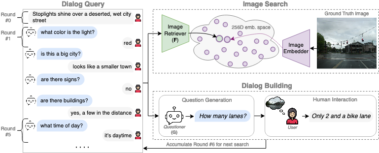

# [NeurIPS 2023] Chatting Makes Perfect: Chat-based Image Retrieval 
#### [[Project Page](https://www.vision.huji.ac.il/chatir/) | [Paper (arxiv)](https://arxiv.org/abs/2305.20062)] #### 
Welcome to the official repository for the NeurIPS 2023 paper, "Chatting makes perfect: Chat-based Image Retrieval"!

Most image searches use just a caption. We took it a step further with ChatIR: our tool that chats with users to pinpoint the perfect image.
 

## Abstract
>*Chats emerge as an effective user-friendly approach for information retrieval, and are successfully employed in many domains, such as customer service, healthcare, and finance.
However, existing image retrieval approaches typically address the case of a single query-to-image round, and the use of chats for image retrieval has been mostly overlooked. In this work, we introduce ChatIR: a chat-based image retrieval system that engages in a conversation with the user to elicit information, in addition to an initial query, in order to clarify the user's search intent. Motivated by the capabilities of today's foundation models, we leverage Large Language Models to generate follow-up questions to an initial image description. These questions form a dialog with the user in order to retrieve the desired image from a large corpus. In this study, we explore the capabilities of such a system tested on a large dataset and reveal that engaging in a dialog yields significant gains in image retrieval. We start by building an evaluation pipeline from an existing manually generated dataset and explore different modules and training strategies for ChatIR. Our comparison includes strong baselines derived from related applications trained with Reinforcement Learning.
Our system is capable of retrieving the target image from a pool of 50K images with over 78\% success rate after 5 dialogue rounds, compared to 75% when questions are asked by humans, and 64% for a single shot text-to-image retrieval. 
Extensive evaluations reveal the strong capabilities and examine the limitations of CharIR under different settings.*

 

## Table of Contents
1. [Benchmark](#benchmark-usage)
2. [Dialogues](#dialogues-on-images)
3. [Citation](#citation)
4. [License](#license)

Certainly! Here's a clearer and simplified version:

---

## Benchmark Usage
Want to test your model on the ChatIR task? Use the script below:
```bash
python eval.py
```
This script uses the CLIP baseline for the ChatIR benchmark, but easy to modify. Remember:

- CLIP is originally trained for captions, not dialogues. So, this is a zero-shot evaluation.
- Dialogues longer than 77 tokens are cut short due to CLIP's token limit. This affects the accuracy of results.

---
## Dialogues on Images
In this section, we show dialogues based on the [VisDial](https://visualdialog.org/)1.0 validation images. Each dialogue encompasses 11 rounds, beginning with the image's caption and followed by 10 rounds of Q&A.
Images are taken from [COCO](https://cocodataset.org/). Please review VisDial data page [here](https://visualdialog.org/data).

| Questioner           | Answerer | File (.json)                                        | Notes                                           |
|----------------------|----------|-----------------------------------------------------|-------------------------------------------------|
| Human                | Human    | [Download](dialogues/VisDial_v1.0_queries_val.json) | This is VisDial1.0 val. set.                    |
| Human                | BLIP2    | [Download](dialogues/Human_BLIP2.json)              | Using VisDial1.0 val. questions.                |
| ChatGPT              | BLIP2    | [Download](dialogues/ChatGPT_BLIP2.json)            |                                                 |
| ChatGPT (Unanswered) | BLIP2    | [Download](dialogues/Unanswered_ChatGPT_BLIP2.json) | Question generation with no answers (see paper) |
| Flan-Alpaca-XXL      | BLIP2    | [Download](dialogues/FLAN_ALPACA_XXL_BLIP2.json)    |                                                 |


For detailed results, plots, and analysis, refer to the `results/` directory.

## Citation
If you find our work useful in your research, please consider citing:
```
soon :)
```

## License
This project is licensed under the MIT License - see the [LICENSE.md](LICENSE.md) file for details.
